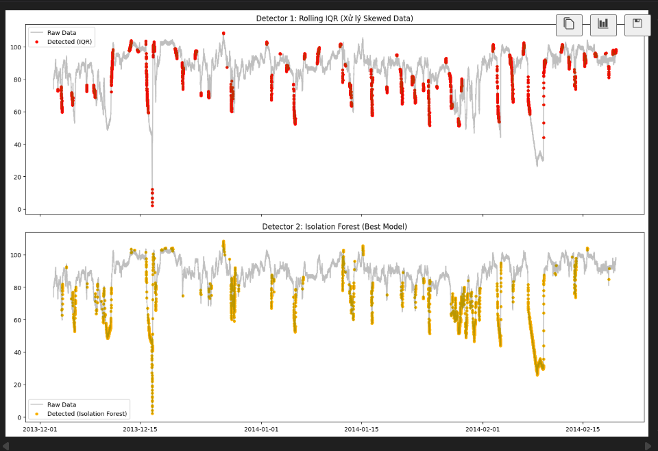

# BÁO CÁO KẾT QUẢ: ANOMALY DETECTION (NAB DATASET)

## 1. Bảng so sánh 2 Detector

| Metric | Detector 1 (Rolling IQR) | IF (cont=0.01) | IF (cont=0.02) | IF (cont=0.05) | IF (cont=0.10) |
| :--- | :--- | :--- | :--- | :--- | :--- |
| **Precision** | 0.092 (9.2%) | 0.648 (64.8%) | 0.643 (64.3%) | 0.406 (40.6%) | 0.310 (31.0%) |
| **Recall** | 0.187 (18.7%) | 0.127 (12.7%) | 0.253 (25.3%) | 0.399 (39.9%) | 0.609 (60.9%) |
| **F1-Score** | 0.123 | 0.213 | 0.363 | 0.402 | 0.411 |
| **False Alarms**| 2130 | 80 | 162 | 674 | 1566 |

---

## 2. Log Tuning Isolation Forest

> --- Tuning Isolation Forest ---
> [IF (cont=0.01)] Precision: 0.648 | Recall: 0.127 | F1: 0.213 | False Alarms: 80
> [IF (cont=0.02)] Precision: 0.643 | Recall: 0.253 | F1: 0.363 | False Alarms: 162
> [IF (cont=0.05)] Precision: 0.406 | Recall: 0.399 | F1: 0.402 | False Alarms: 674
> [IF (cont=0.1)]  Precision: 0.310 | Recall: 0.609 | F1: 0.411 | False Alarms: 1566

---

## 3. Screenshots

**Biểu đồ phát hiện bất thường (Anomaly Detection Plot):**

---

## 4. Model Artifacts

* **Tên file:** `isolation_forest_best.pkl`
* **Kích thước:** < 1MB

---

## 5. Reflection (Phân tích & Đánh giá)

### a. Đặc điểm dữ liệu (Data characteristics)
Qua bước Exploratory Data Analysis (EDA), em rút ra kết luận tập dữ liệu `machine_temperature_system_failure` có các đặc tính sau:
* **Không dừng (Non-stationary):** Chuỗi thời gian bị phá vỡ trạng thái cân bằng bởi các đợt sụt giảm nhiệt độ đột ngột khi máy móc hỏng hóc.
* **Phi chu kỳ (Non-seasonal):** Đồ thị ACF trượt giảm dần (smooth decay), không có bước sóng lặp lại, cho thấy lỗi xảy ra ngẫu nhiên chứ không theo mùa hay chu kỳ thời gian cố định.
* **Lệch trái nặng (Heavily Left-Skewed):** Phân phối không đối xứng, đỉnh tập trung ở dải nhiệt độ cao (80-100) với phần đuôi dài kéo về phía các giá trị thấp (0-20). 

### b. Lựa chọn phương pháp (Method Selection)
* **Detector 1 (Statistical):** Vì dữ liệu bị lệch nặng và không có chu kỳ, các phương pháp như 3-Sigma hay STL Decomposition sẽ không hiệu quả. Em chọn **Rolling IQR** vì nó dựa trên bách phân vị (percentile), giúp thuật toán bền bỉ (robust) hơn và không bị nhiễu bởi sự bất đối xứng của phân phối.
* **Detector 2 (ML):** Em chọn **Isolation Forest** kết hợp với Feature Engineering (tạo thêm các biến như `roll_mean_1h`, `roll_std_1h`, `rate_of_change`). Phương pháp này không đòi hỏi dữ liệu phải có phân phối chuẩn và có khả năng nắm bắt "ngữ cảnh" của chuỗi thời gian thay vì chỉ xét trên một điểm tĩnh.

### c. Đánh giá hiệu năng & Trade-off
* **Detector nào tốt hơn?** Isolation Forest áp đảo hoàn toàn Rolling IQR. Rolling IQR quá nhạy cảm, bắt lỗi ở mọi biến động nhỏ dẫn đến lượng False Alarms khổng lồ (2130). Ngược lại, Isolation Forest khoanh vùng chính xác các đợt tụt giảm nhiệt độ sâu kỷ lục.
* **Trade-off (Sự đánh đổi):** Quá trình tuning `contamination` cho thấy rõ sự đánh đổi kinh điển giữa Precision và Recall. Khi `contamination` thấp (0.01), mô hình có Precision rất cao (64.8%) nhưng bỏ lọt nhiều lỗi (Recall 12.7%). Khi đẩy `contamination` lên cao (0.1), thuật toán bắt được nhiều lỗi hơn (Recall 60.9%) nhưng đổi lại tỷ lệ báo động giả tăng vọt.

### d. Quyết định triển khai (Production Choice)
Mặc dù mức `contamination = 0.1` cho F1-score cao nhất, nhưng nếu đưa vào thực tế (Production), lượng báo động giả quá lớn (1566) sẽ gây ra hiện tượng "lờn cảnh báo" (Alert Fatigue) cho đội ngũ bảo trì. 
Do đó, **Production Choice tối ưu là Isolation Forest với `contamination = 0.02`**. Ở mức này, Precision duy trì rất tốt ở mức 64.3%, số lượng báo động giả được kiểm soát chặt chẽ (chỉ 162 ca), giúp kỹ sư tập trung đúng vào các thời điểm máy móc có nguy cơ hỏng hóc cao nhất, mang lại giá trị thực tiễn tốt hơn.

### e. Bonus: Đánh giá phương pháp EWMA (Exponentially Weighted Moving Average)
Em đã thử nghiệm thêm phương pháp EWMA với hệ số học `alpha = 0.1` và ngưỡng Z-score `2.5`. Kết quả thu được là: 
* **Precision:** 0.077
* **Recall:** 0.018
* **F1-Score:** 0.029
* **False Alarms:** 251

**Nhận xét & So sánh 3 phương pháp:**
1. **Lý do EWMA thất bại (Recall chạm đáy 1.2%):** 
   * Thuật toán EWMA (đặc biệt với `alpha=0.1`) thích nghi quá nhanh với sự thay đổi của dữ liệu mới. Khi nhiệt độ máy bắt đầu tụt dốc hỏng hóc, đường trung bình EWMA cũng lập tức "bẻ lái" chạy theo sát giá trị tụt giảm đó. 
   * Hậu quả là, khoảng cách giữa giá trị thực tế và giá trị EWMA dự đoán nhanh chóng thu hẹp lại, khiến điểm số `ewma_zscore` rớt xuống dưới ngưỡng 2.5. Thuật toán chỉ chớp được khoảnh khắc máy vừa "giật mình" rớt nhiệt độ ở vài phút đầu tiên, và hoàn toàn bỏ lỡ phần còn lại của chuỗi thời gian máy bị hỏng (đó là lý do Recall chỉ đạt 1.8%).
   * Thêm vào đó, EWMA Z-score vẫn mang bản chất của Z-score, tức là ngầm giả định sai số có phân phối chuẩn. Nhưng như đã phân tích ở phần EDA, dữ liệu của chúng ta bị lệch trái (heavily left-skewed).

2. **Xếp hạng 3 phương pháp:**
   * **Top 1 - Isolation Forest (ML):** Vẫn là nhà vô địch tuyệt đối. Nó không bị bó buộc bởi phân phối dữ liệu, xử lý tốt các biến động bất đối xứng, và có khả năng bao quát toàn bộ ngữ cảnh nhờ feature engineering.
   * **Top 2 - Rolling IQR (Thống kê):** Mặc dù tạo ra lượng False Alarms khổng lồ do quá nhạy cảm, ít nhất nó vẫn giữ được Recall ở mức 18.7% vì ranh giới IQR không bị "bẻ cong" quá nhanh như EWMA.
   * **Top 3 - EWMA (Thống kê):** Thất bại trong bài toán này vì khả năng "quên lãng quá khứ và thích nghi với thực tại" diễn ra quá nhanh, làm mất đi tín hiệu cảnh báo kéo dài của sự cố.

### f. Bonus 2: Đánh giá Log Transform kết hợp Rolling 3-Sigma
Em đã thực hiện biến đổi logarit (`np.log1p`) trên dữ liệu gốc để cố gắng giảm độ lệch (skewness) trước khi đưa vào thuật toán Rolling 3-Sigma. Kết quả thu được:

* **Raw Rolling 3-Sigma:** Precision 0.025 | Recall 0.021 | F1 0.023 | False Alarms: 934
* **Log-Transformed 3-Sigma:** Precision 0.021 | Recall 0.018 | F1 0.019 | False Alarms: 993

**Nhận xét & Phân tích:**
1. **Sự thất bại của Log Transform trên Left-Skewed Data:** * Có thể thấy, việc biến đổi Logarit hầu như không cải thiện được hiệu năng (F1 chỉ tăng 0.003) mà còn làm tăng số lượng báo động giả. Nguyên nhân gốc rễ nằm ở bản chất toán học của hàm Logarit.
   * Log Transform có tác dụng nén các giá trị lớn lại gần nhau, nên nó là "thần dược" để xử lý dữ liệu bị **Lệch phải (Right-Skewed)** (có đuôi dài về phía các giá trị dương lớn).
   * Tuy nhiên, như đã phân tích ở Phase 1, dữ liệu nhiệt độ của chúng ta bị **Lệch trái nặng (Left-Skewed)** (đuôi dài kéo về phía giá trị 0). Việc áp dụng Log Transform lên dữ liệu lệch trái không những không làm nó giống phân phối chuẩn (Gaussian) hơn, mà đôi khi còn kéo giãn cái đuôi bên trái ra xa hơn nữa. Để xử lý left-skew, đúng ra phải dùng phép biến đổi lũy thừa (Square/Cube Transform) hoặc phản xạ dữ liệu (Reflect then Log).

2. **Hạn chế cố hữu của Rolling 3-Sigma:**
   * Dù có biến đổi dữ liệu hay không, mức Recall của phương pháp này vẫn chạm đáy. Lý do tương tự như EWMA: khi nhiệt độ rớt thê thảm, đường trung bình (Rolling Mean) và độ lệch chuẩn (Rolling Std) cũng bị kéo tụt xuống theo. Dải ranh giới $3\sigma$ nhanh chóng mở rộng và bao trọn lấy vùng dữ liệu lỗi, khiến nó mù lòa trước sự cố sau vài nhịp đầu tiên.

### g. Bonus 3: Đánh giá Multivariate Isolation Forest (Kết hợp Temperature & CPU)
Em đã gộp thêm chuỗi dữ liệu `cpu_utilization_asg_misconfiguration.csv` vào dữ liệu nhiệt độ gốc, tạo ra các đặc trưng (`temp_val`, `cpu_val`, `temp_diff`, `cpu_diff`) và chạy thuật toán Isolation Forest đa biến (Multivariate) với cùng mức `contamination = 0.1`.

**So sánh kết quả (cùng cont=0.1):**
* **Univariate IF (Chỉ dùng Temp):** Precision 0.310 | Recall 0.609 | F1 0.411 | False Alarms: 1566
* **Multivariate IF (Temp + CPU):** Precision 0.282 | Recall 0.553 | F1 0.373 | False Alarms: 1630

**Nhận xét & Phân tích:**
1. **Nghịch lý "Càng nhiều dữ liệu, mô hình càng kém":** * Trái với tư duy thông thường là đưa thêm biến sẽ giúp mô hình thông minh hơn, việc kết hợp biến CPU đã làm **giảm toàn diện** mọi chỉ số. Mô hình bắt lỗi kém hơn (Recall giảm từ 60.9% xuống 55.3%), dự đoán sai nhiều hơn (Precision giảm từ 31% xuống 28.2%), và lượng báo động giả vọt lên mức cao nhất (1630 ca).

2. **Giải thích nguyên lý (Feature Noise & Label Mismatch):**
   * **Nhiễu dữ liệu (Noise Effect):** Thuật toán Isolation Forest hoạt động bằng cách chọn ngẫu nhiên các đặc trưng (features) để cắt/phân nhánh (split). Việc đưa thêm `cpu_val` và `cpu_diff` vào khiến cây quyết định lãng phí các nhát cắt vào những biến không mang tín hiệu cảnh báo hỏng hóc nhiệt độ. Nó làm mô hình bị "phân tâm" (distracted) khỏi mục tiêu chính.
   * **Sai lệch nhãn (Label Mismatch):** Cột `is_anomaly` (Ground truth) là nhãn đánh dấu sự cố của hệ thống Nhiệt độ. Trong khi đó, file CPU thuộc về một server/hệ thống hoàn toàn khác. Khi mô hình Isolation Forest phát hiện ra sự bất thường của biến CPU, nó cảnh báo lỗi. Nhưng vì điểm đó không trùng với lỗi Nhiệt độ, hệ thống đánh giá đó là Cảnh báo giả (False Alarm). 

**Bài học rút ra cho môi trường Production:**
Thực nghiệm này chứng minh một định lý quan trọng trong Data Science: **Garbage In, Garbage Out (GIGO)**. Kỹ thuật Multivariate (Đa biến) chỉ thực sự phát huy sức mạnh khi các biến đầu vào có sự liên kết vật lý hoặc tương quan logic nội tại (ví dụ: Nhiệt độ và Dòng điện của *cùng một* cỗ máy). Việc gộp ngẫu nhiên các nguồn dữ liệu không liên quan (uncorrelated features) không những không giúp ích mà còn trở thành "nhiễu trắng", phá hỏng hoàn toàn hiệu năng của mô hình.