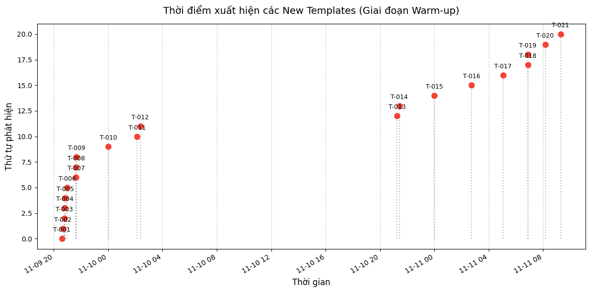
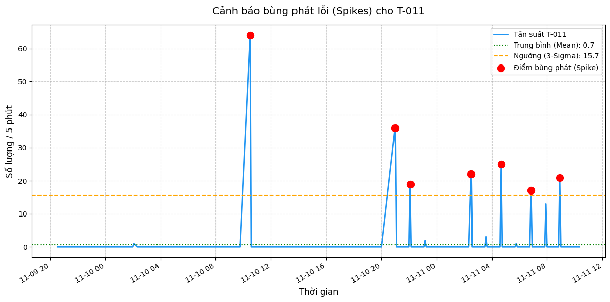
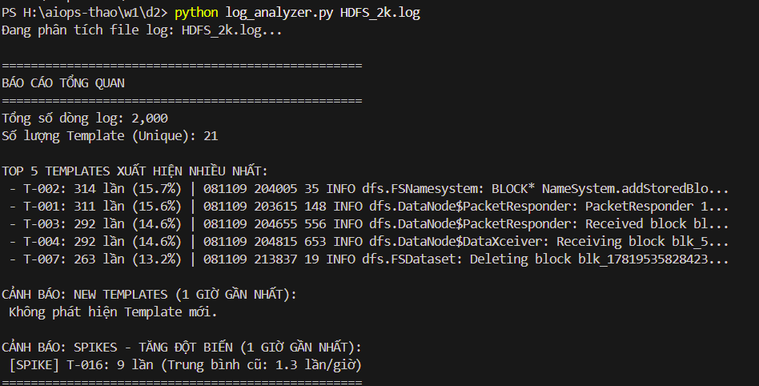
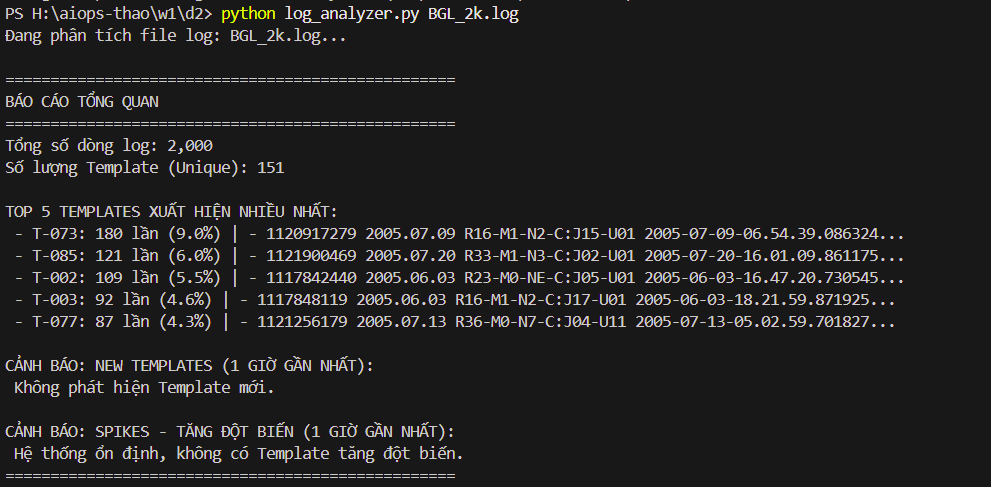
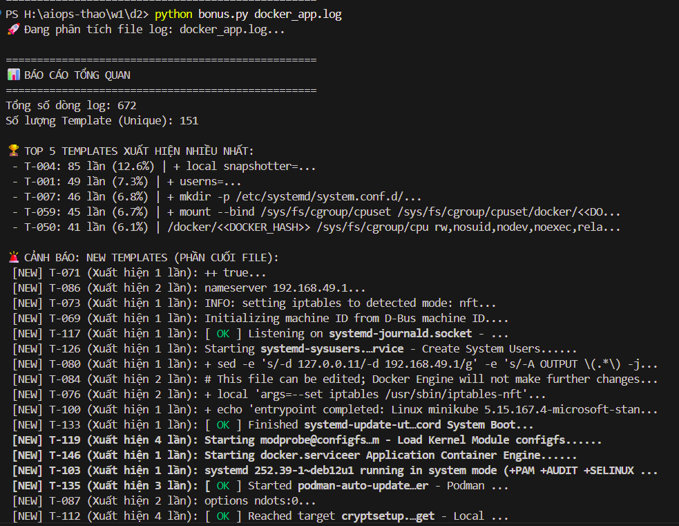
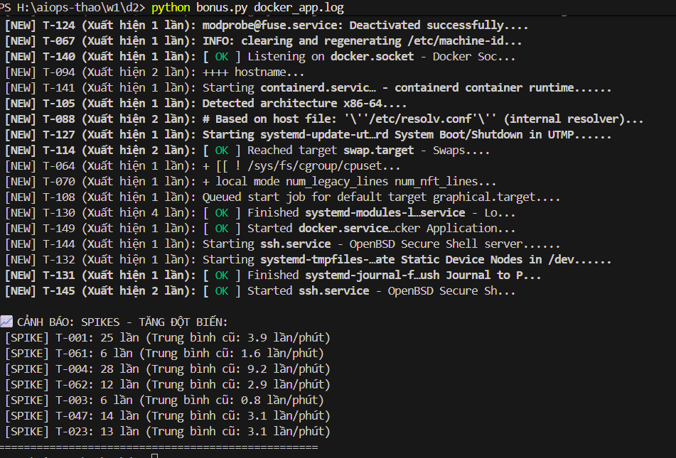

# BÁO CÁO ASSIGNMENT: LOG MINING & ANOMALY DETECTION

---

## 1. Screenshots

### 1.1. Biểu đồ Time Series của Template Count

### 1.2. Anomaly Highlighted 

### 1.3. Phase 3

- Dataset HDFS: Chỉ sinh ra 21 templates unique.
- Dataset BGL: Sinh ra tới 151 templates unique (gấp hơn 7 lần so với HDFS).

#### Giải Thích 

1. HDFS (Hadoop Distributed File System) - Hệ thống phần mềm đơn nhiệm
Bản chất: HDFS là một phần mềm hệ thống tập tin phân tán. Nhiệm vụ cốt lõi của nó chỉ xoay quanh một vài hành động cụ thể: chia nhỏ file, gửi block dữ liệu, nhận block dữ liệu, xóa block, và kiểm tra sức khỏe của các node.
Hệ quả đối với Log: Vì tính chất công việc lặp đi lặp lại rất quy chuẩn, các dòng log sinh ra có sự đồng nhất cao về mặt từ vựng và cấu trúc (ví dụ: Receiving block..., Deleting block...). Do đó, thuật toán Drain3 dễ dàng gom 2,000 dòng log này lại thành một nhóm nhỏ gọn chỉ gồm 21 khuôn mẫu.

2. BGL (Blue Gene/L) - Siêu máy tính phần cứng phức tạp
Bản chất: Blue Gene/L là hệ thống siêu máy tính (Supercomputer) do IBM sản xuất, bao gồm hàng chục ngàn linh kiện: vi xử lý (CPU), chip nhớ (Memory), bảng mạch nội bộ (Node cards), hệ thống mạng lưới (Switch/Router), cảm biến nhiệt độ, và nguồn điện.
Hệ quả đối với Log: Log của BGL là sự pha trộn hỗn mang của cả phần cứng lẫn phần mềm. Một dòng log có thể là thông báo lỗi của hệ điều hành Linux, dòng tiếp theo lại là cảnh báo quá nhiệt từ một con chip, và dòng khác nữa là lỗi cáp quang rớt mạng. Sự đa dạng cực lớn về thành phần hệ thống dẫn đến từ vựng phong phú, cấu trúc câu phức tạp và rất nhiều mã định danh phần cứng khác nhau. Đó là lý do Drain3 phải chẻ nhỏ tập dữ liệu ra thành 151 templates để đảm bảo không bị lẫn lộn giữa lỗi nguồn điện và lỗi phần mềm.

---

## 2. Log Output

### 2.1. Tuning `drain_sim_th` (Dataset: HDFS_2k.log)

| Ngưỡng `sim_th` | Tổng số dòng | Số Template sinh ra | Đánh giá |
| :--- | :--- | :--- | :--- |
| **0.3** | 2,000 | 41 | Quá thấp (Under-splitting). Gộp nhầm các log khác ngữ nghĩa. |
| **0.5** | 2,000 | **48** | **Cân bằng tối ưu (Sweet spot).** Bóc tách chính xác các sự kiện. |
| **0.7** | 2,000 | 916 | Quá cao (Over-splitting). Tạo ra vô số template rác từ việc thay đổi mã Block ID của HDFS. |

**Kết luận:** Cấu hình `drain_sim_th = 0.5` được chọn làm tiêu chuẩn cho các phân tích cốt lõi.

### 2.2. Top 5 Templates xuất hiện nhiều nhất (`sim_th = 0.5`)

1. **T-002: 314 lần (15.7%)** | `081109 204005 35 INFO dfs.FSNamesystem: BLOCK* NameSystem.addStoredBlo...`
2. **T-001: 311 lần (15.6%)** | `081109 203615 148 INFO dfs.DataNode$PacketResponder: PacketResponder 1...`
3. **T-003: 292 lần (14.6%)** | `081109 204655 556 INFO dfs.DataNode$PacketResponder: Received block bl...`
4. **T-004: 292 lần (14.6%)** | `081109 204815 653 INFO dfs.DataNode$DataXceiver: Receiving block blk_5...`
5. **T-007: 263 lần (13.2%)** | `081109 213837 19 INFO dfs.FSDataset: Deleting block blk_17819535828423...`

---

## 3. Reflection 

### 3.1. Đánh giá thuật toán Drain3
**Ưu điểm:** Thuật toán hoạt động cực kỳ nhanh và linh hoạt. Thông qua cơ chế học tương phản (Contrast Learning), Drain3 tự động phát hiện các chuỗi ký tự thay đổi liên tục (như IP, Block ID, dung lượng) và biến chúng thành các ký tự đại diện `<*>`, giúp gom nhóm chính xác hàng triệu dòng log mà không cần viết tay Regex.

**Hạn chế phát hiện được:**
* Khi log chỉ xuất hiện đúng 1 lần (như lúc tiêm dòng log giả mạo, hoặc parse duy nhất 1 dòng ở Bonus 3), Drain3 sẽ giữ nguyên 100% nội dung vì không có dữ liệu đối chiếu để tìm ra phần động.
* Đối với log hạ tầng đặc thù (VD: Log Docker chứa mã hash `dc3c988...` dính liền với đường dẫn `/docker/`), Drain3 gặp khó khăn do không thể bẻ gãy từ vựng (tokenize) qua khoảng trắng. Cần kết hợp thêm `RegexMaskingInstruction` ở bước tiền xử lý để thuật toán đạt độ chính xác tối đa.

### 3.2. Sức mạnh Insight từ Template Log
Việc biến text thô thành Template ID mang lại sức mạnh to lớn trong việc phân tích chéo (Cross-signal). 
Ví dụ: Thuật toán 3-Sigma đã phát hiện **T-011** (Lỗi Exception khi phục vụ data) và **T-007** (Hành động xóa block) cùng bùng phát đồng thời tại một khung giờ. Insight này giúp kỹ sư xác định ngay lập tức nguyên nhân gốc rễ (Root Cause) có tính nhân quả thay vì phải mò mẫm đọc hàng nghìn dòng văn bản hỗn độn.

### 3.3. Metric vs Log trong giám sát hệ thống
* **Metric (Số liệu):** Giống như nhiệt kế. Nó cho biết **"Cái gì đang sai?"** (What) — ví dụ: độ trễ mạng tăng, CPU chạm 100%. Metric lý tưởng để kích hoạt cảnh báo (Alert) tức thì nhưng không thể chỉ điểm dòng code gây lỗi.
* **Log (Nhật ký):** Giống như hồ sơ bệnh án. Nó cho biết **"Tại sao lại sai?"** (Why). Log chứa toàn bộ ngữ cảnh (Context). 

## 4. Bonus

### 4.1. Docker Execution Trace
Tiến hành phân tích file `docker_app.log` (Execution Trace của Minikube/Docker).

**Thách thức gặp phải:**
1. **Thiếu nhãn thời gian:** File log dạng Bash Execution Trace (bắt đầu bằng `+`) không đi kèm timestamp, khiến hệ thống không thể xây dựng Time series để bắt Spikes.
2. **Nhiễu dữ liệu:** Log chứa các mã băm (Hash) dài 64 ký tự dính liền vào đường dẫn (Ví dụ: `/sys/fs/cgroup/cpu/docker/dc3c...`), khiến Drain3 không thể phân tách tự động bằng khoảng trắng.

**Giải pháp AIOps đã áp dụng:**
1. **Simulated Time:** Xây dựng logic giả lập mốc thời gian tăng dần 1 giây cho mỗi dòng log để kích hoạt thành công module phát hiện Spike.
2. **Regex Masking Instruction:** Tiêm luật Regex `r'[a-f0-9]{64}'` vào cấu hình Drain3 để tiền xử lý (Pre-process), tự động che các mã băm thành `<DOCKER_HASH>` trước khi đưa vào cây phân tích.

**Kết quả:**
* Hệ thống gom cụm thành công 672 dòng log phức tạp thành 151 Templates.
* Các đường dẫn động đã được chuẩn hóa gọn gàng (VD: `T-050: /docker/<DOCKER_HASH> /sys/fs/cgroup/cpu rw...`), giảm thiểu tối đa hiện tượng sinh template rác.

### 4.2. So sánh Structured JSON log vs Unstructured Plain Text log
Thông qua thử nghiệm phân tích log mô phỏng của hệ thống AI, việc thiết kế định dạng log đóng vai trò quyết định đến hiệu suất giám sát:

* **Sử dụng Unstructured Plain Text:** Hệ thống ghi log dạng chuỗi như `User requested vector search in 145ms`. Bắt buộc phải triển khai thuật toán như Drain3 để parse, gây tiêu tốn CPU. Các tham số như `145ms` bị làm mờ thành `<*>`, khiến việc tổng hợp thống kê độ trễ (latency) gặp nhiều trở ngại.
* **Sử dụng Structured JSON:** Hệ thống ghi log dưới dạng Key-Value: `{"action": "vector_search", "latency_ms": 145}`. 
* **Kết luận (AIOps Insight):** Structured Log (JSON) là Best Practice. Hệ thống giám sát có thể truy vấn trực tiếp trường dữ liệu (ví dụ: `latency_ms`) với chi phí thời gian $O(1)$ mà không cần bước parse, loại bỏ hoàn toàn rủi ro gom cụm nhầm của thuật toán. Drain3 chỉ nên được dùng như giải pháp cứu cánh để phân tích các hệ thống cũ (Legacy) hoặc hạ tầng lõi không hỗ trợ xuất JSON.

### 4.3. So sánh Regex Parser vs Drain3 Parser
Phân tích đối chiếu dựa trên file Nginx Access Log và Docker Log:

| Tiêu chí | Regex Parser (Viết tay) | Drain3 Parser (Thuật toán cây) |
| :--- | :--- | :--- |
| **Cơ chế** | Tìm kiếm khớp chuỗi theo khuôn mẫu định nghĩa cứng (Hardcoded). | Xây dựng cây phân loại (Parse Tree) để tự học cấu trúc. |
| **Độ chính xác** | **Tuyệt đối (100%).** Bóc tách chính xác các trường được chỉ định (IP, Status Code, Path). | **Tương đối.** Khái quát hóa được thông báo, nhưng hệ thống không hiểu ngữ nghĩa của dấu `<*>` là IP hay dung lượng. |
| **Độ linh hoạt (Resilience)**| **Rất kém.** Nếu sysadmin đổi cấu hình (VD: thêm cột User-Agent), file Regex ngay lập tức báo lỗi và hệ thống giám sát bị "mù". | **Tuyệt vời.** Drain3 sẽ tự động nhận diện mẫu câu mới và sinh ra Template ID mới mà không yêu cầu lập trình viên can thiệp sửa code. |
| **Quy mô (Scale)** | Khó bảo trì. Triển khai 100 service khác nhau sẽ cần viết và duy trì 100 đoạn Regex phức tạp. | Dễ dàng mở rộng. Triển khai một lần cấu hình, áp dụng chung cho mọi loại service. |

**Kết luận:** Regex phù hợp để trích xuất một trường dữ liệu cụ thể, cố định. Trong môi trường microservices liên tục cập nhật, Drain3 là giải pháp phân loại linh hoạt, bền vững và tự động hóa cao hơn rất nhiều.