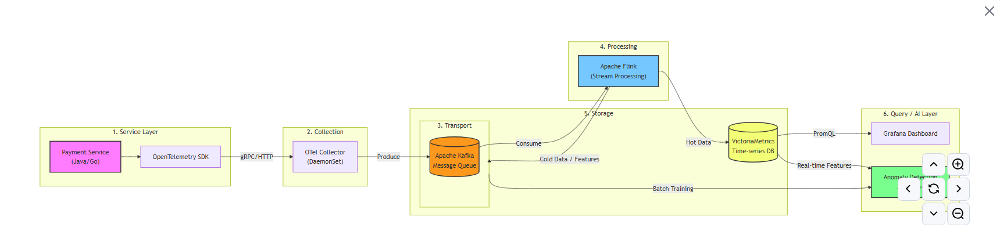
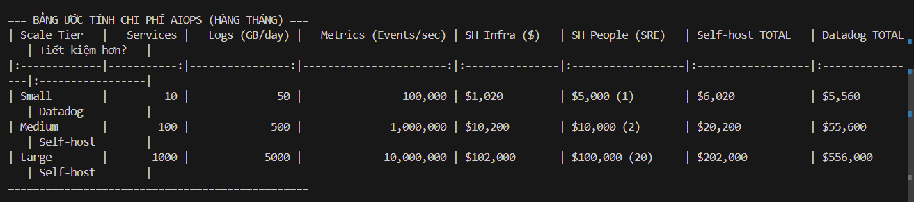

# ASSIGNMENT: DATA LAYER ARCHITECTURE & OBSERVABILITY PIPELINE

## 1. Sơ đồ Kiến trúc (Architecture Diagram)

## 2. Bảng Ước tính Chi phí (Cost Estimation)

| Scale Tier | Services | Logs (GB/day) | Metrics (Events/sec) | SH Infra ($) | SH People (SRE) | Self-host TOTAL | Datadog TOTAL | Tiết kiệm hơn? |
| :--- | :--- | :--- | :--- | :--- | :--- | :--- | :--- | :--- |
| Small | 10 | 50 | 100,000 | $1,020 | $5,000 (1) | $6,020 | $5,560 | Datadog |
| Medium | 100 | 500 | 1,000,000 | $10,200 | $10,000 (2) | $20,200 | $55,600 | Self-host |
| Large | 1000 | 5000 | 10,000,000 | $102,000 | $100,000 (20) | $202,000 | $556,000 | Self-host |

## 3. Tóm tắt Quyết định Kiến trúc (ADR Decision Summary)
* **Quyết định:** Chọn mô hình **Mua (Buy - Datadog SaaS)** thay vì **Tự xây dựng (Build - Self-host Kafka/Flink/Loki)** cho giai đoạn hiện tại (Medium Tier - 50 services).
* **Lý do chính:** Ưu tiên số một của hệ thống là tốc độ triển khai (Time-to-market). Dù chi phí hạ tầng của SaaS ($55,600) cao hơn so với tự xây ($20,200 đã bao gồm lương SRE), nhưng nó giúp tiết kiệm 3-6 tháng phát triển Data Layer phức tạp, giảm tải áp lực vận hành và loại bỏ hoàn toàn rủi ro mất mát dữ liệu do cấu hình sai. Team kỹ thuật có thể tập trung 100% vào việc phát triển tính năng sản phẩm cốt lõi.

## 4. Reflection của Platform Engineer
**Ngữ cảnh:** Được thuê làm Platform Engineer cho startup 50-service vừa gọi vốn Series A.

**Khuyến nghị:** Em sẽ chọn **BUY (SaaS như Datadog)**.

**Lập luận (Tại sao?):**
1. **Quản trị rủi ro & Chi phí cơ hội:** Ở giai đoạn Series A, công ty đã có dòng vốn nhưng áp lực chứng minh sản phẩm với thị trường (Product-Market Fit) và mở rộng kinh doanh là cực kỳ lớn. Thời gian của kỹ sư là tài sản quý giá nhất. Thay vì tiêu tốn hàng tháng trời để thiết lập, tinh chỉnh và quản lý một hệ thống Kafka hay Elasticsearch khổng lồ, việc trả tiền cho SaaS giúp chúng ta có ngay một hệ thống Observability chuẩn production trong 1 tuần. 
2. **Khó khăn trong tuyển dụng SRE:** Việc tìm kiếm và giữ chân các kỹ sư SRE giỏi, có kinh nghiệm vận hành hệ thống phân tán không hề dễ dàng và rẻ (khoảng $3000 - $5000/tháng). Nếu hệ thống tự build gặp sự cố vào lúc nửa đêm, chi phí downtime đối với một startup đang trên đà tăng trưởng còn đắt đỏ hơn nhiều so với việc trả phí SaaS.
3. **Chiến lược dài hạn:** Để giảm thiểu rủi ro Vendor Lock-in (bị phụ thuộc hoàn toàn vào Datadog), em sẽ thiết kế kiến trúc sử dụng **OpenTelemetry** làm Data Collection Layer. Bằng cách này, source code của 50 services hoàn toàn độc lập với Datadog. Trong tương lai 1-2 năm tới, khi lượng data chạm mốc "Large" (hàng TB log/ngày) và chi phí SaaS trở thành gánh nặng lớn, chúng ta có thể dễ dàng định tuyến lại luồng dữ liệu (routing) về một hệ thống Self-host nội bộ mà không cần phải viết lại code ở phía các services.