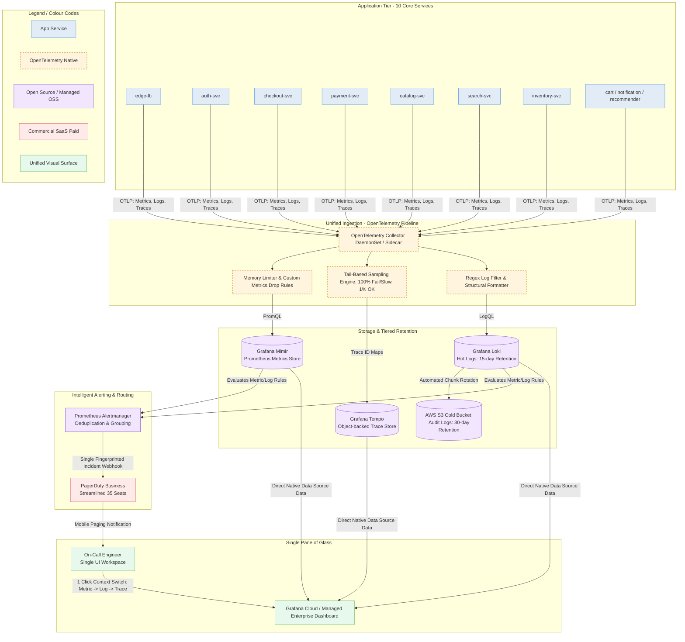

```mermaid
graph TD
    classDef app fill:#E2ECF7,stroke:#4A90E2,stroke-width:1px;
    classDef otele fill:#FFF4DE,stroke:#D9A74A,stroke-width:2px,stroke-dasharray: 4 4;
    classDef oss fill:#F2E6FF,stroke:#8A49D6,stroke-width:1px;
    classDef saas fill:#FFEAEA,stroke:#D9534F,stroke-width:1px;
    classDef human fill:#E6F9EC,stroke:#5CB85C,stroke-width:1px;

    %% 10 Application Services Layer
    subgraph App_Tier [Application Tier - 10 Core Services]
        edge_lb[edge-lb]:::app
        auth_svc[auth-svc]:::app
        checkout_svc[checkout-svc]:::app
        payment_svc[payment-svc]:::app
        catalog_svc[catalog-svc]:::app
        search_svc[search-svc]:::app
        inventory_svc[inventory-svc]:::app
        other_svcs[cart / notification / recommender]:::app
    end

    %% Unified Ingestion Pipeline
    subgraph Ingestion_Tier [Unified Ingestion - OpenTelemetry Pipeline]
        OTel_Col[OpenTelemetry Collector DaemonSet / Sidecar]:::otele
        
        %% Edge processing rules
        filter_card[Memory Limiter & Custom Metrics Drop Rules]:::otele
        tail_sample[Tail-Based Sampling Engine: 100% Fail/Slow, 1% OK]:::otele
        log_transform[Regex Log Filter & Structural Formatter]:::otele
    end

    %% Data Connections to Collector
    edge_lb & auth_svc & checkout_svc & payment_svc & catalog_svc & search_svc & inventory_svc & other_svcs -->|OTLP: Metrics, Logs, Traces| OTel_Col
    OTel_Col --> filter_card
    OTel_Col --> tail_sample
    OTel_Col --> log_transform

    %% Storage & Retention Tiers
    subgraph Storage_Tier [Storage & Tiered Retention]
        Mimir[(Grafana Mimir <br> Prometheus Metrics Store)]:::oss
        Tempo[(Grafana Tempo <br> Object-backed Trace Store)]:::oss
        Loki[(Grafana Loki <br> Hot Logs: 15-day Retention)]:::oss
        S3[(AWS S3 Cold Bucket <br> Audit Logs: 30-day Retention)]:::oss
    end

    filter_card -->|PromQL| Mimir
    tail_sample -->|Trace ID Maps| Tempo
    log_transform -->|LogQL| Loki
    Loki -->|Automated Chunk Rotation| S3

    %% Alerting and Correlation Interface
    subgraph Alert_Tier [Intelligent Alerting & Routing]
        Alertmanager[Prometheus Alertmanager <br> Deduplication & Grouping]:::oss
        PagerDuty[PagerDuty Business <br> Streamlined 35 Seats]:::saas
    end

    Mimir & Loki -->|Evaluates Metric/Log Rules| Alertmanager
    Alertmanager -->|Single Fingerprinted Incident Webhook| PagerDuty

    %% Unified Human Interaction Surface
    subgraph Human_Tier [Single Pane of Glass]
        Grafana[Grafana Cloud / Managed Enterprise Dashboard]:::human
        OnCall[On-Call Engineer <br> Single UI Workspace]:::human
    end

    Mimir & Loki & Tempo -->|Direct Native Data Source Data| Grafana
    PagerDuty -->|Mobile Paging Notification| OnCall
    OnCall -->|1 Click Context Switch: Metric -> Log -> Trace| Grafana

    %% Legend
    subgraph Legend [Legend / Colour Codes]
        L1[App Service]:::app
        L2[OpenTelemetry Native]:::otele
        L3[Open Source / Managed OSS]:::oss
        L4[Commercial SaaS Paid]:::saas
        L5[Unified Visual Surface]:::human
    end
```