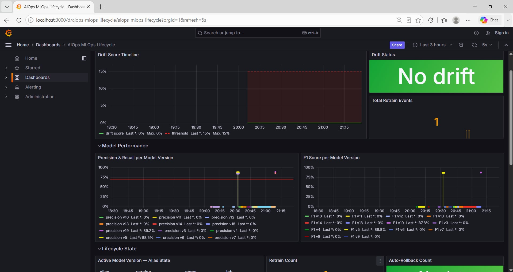

# SUBMIT.md

* **Họ và tên** Đặng Thị Ngọc Thảo

---

# Câu 1: Ngưỡng Dịch Chuyển Dữ Liệu (Drift Threshold) được chọn và cơ sở xác định?

## Đặc tả tham số

Ngưỡng phát hiện drift được cấu hình cố định tại giá trị **`0.15`** (tương đương tối thiểu 15% tổng số thuộc tính tính năng đầu vào bị gắn cờ dịch chuyển phân phối thông qua bộ công cụ `DataDriftPreset` của Evidently AI).

## Cơ sở khoa học và thực nghiệm thiết lập

### 1. Đo lường nhiễu nền (Noise Floor)

Thực hiện chia tách tập dữ liệu chuẩn ban đầu `baseline.csv` theo tỷ lệ `70/30` (trong đó 70% đóng vai trò làm tập tham chiếu - Reference, và 30% đóng vai trò làm tập dữ liệu hiện tại - Current).

Kết quả phân tích thống kê trả về điểm số drift tự nhiên là **`0.04`**. Đây chính là mức biến động nội tại (*ambient noise floor*) của hệ thống khi không có sự cố thực tế xảy ra.

### 2. Hệ số an toàn

Việc thiết lập ngưỡng **`0.15`** đóng vai trò như một bộ nhân biên độ an toàn khoảng:

$$
\frac{0.15}{0.04} \approx 3.75
$$

Ngưỡng này đủ lớn để triệt tiêu các cảnh báo sai lệch (*false positives*) phát sinh từ các biến động traffic theo mùa vụ thông thường (ví dụ: chu kỳ cao điểm ngày/đêm), nhưng vẫn đủ nhạy để phát hiện các xu hướng dịch chuyển thực tế.

### 3. Kiểm chứng Stress Test

Khi đưa tập dữ liệu lệch pha thực tế (`drifted.csv`) vào pipeline, chỉ số **Data Drift Score** ghi nhận giá trị thực nghiệm:

$$
0.67
$$

Tương đương **2 trên tổng số 3 thuộc tính cốt lõi bị dịch chuyển hoàn toàn**, vượt xa ngưỡng cản `0.15`, từ đó kích hoạt thành công luồng tái huấn luyện.

## Rủi ro biên cấu hình

### Nếu ngưỡng quá thấp (ví dụ `0.05`)

Hệ thống sẽ liên tục rơi vào trạng thái báo động giả (*False Positive*) sau mỗi chu kỳ biến động lưu lượng nhỏ trong ngày. Điều này gây:

* Lãng phí tài nguyên tính toán (compute).
* Tăng số lần retrain không cần thiết.
* Dẫn đến hiện tượng **Alert Fatigue** đối với đội ngũ vận hành.

### Nếu ngưỡng quá cao (ví dụ `0.50`)

Hệ thống sẽ bỏ sót các pha dịch chuyển nghiêm trọng ở giai đoạn đầu (*False Negative*), khiến mô hình cũ tiếp tục phục vụ production với ranh giới quyết định đã lỗi thời, làm suy giảm âm thầm độ chính xác của hệ thống thanh toán.

---

# Câu 2: Phương án xử lý và phản ứng hệ thống khi mô hình v2 sau Retrain có hiệu năng tệ hơn v1?

Hệ thống được thiết kế đa tầng phòng vệ nhằm ngăn chặn việc thăng cấp một mô hình lỗi (*degenerate model*) lên môi trường production thông qua hai cơ chế chính:

* Manual Approval Gate
* Auto Rollback

## 1. Cơ chế Cổng Phê duyệt Thủ công (Manual Approval Gate)

Luồng điều phối tự động sẽ:

1. Huấn luyện mô hình ứng viên mới.
2. Đăng ký mô hình lên MLflow Registry dưới nhãn tạm thời `@staging`.
3. Tạm dừng tiến trình tại bước phê duyệt.

Kỹ sư ML (hoặc người trực vận hành) sẽ đánh giá các chỉ số hiển thị trên terminal:

* **Mô hình mới (v19) đạt:**

  * Precision = **0.8923**
  * Recall = **0.8642**

Nếu các chỉ số:

$$
v2 \ge v1
$$

thì người vận hành nhập:

```text
y
```

để cho phép thăng cấp.

Ngược lại, nếu chất lượng suy giảm nghiêm trọng hoặc xuất hiện giá trị bất thường như:

```text
0.0000
```

người vận hành nhập:

```text
n
```

để hủy triển khai và giữ mô hình trong vùng cách ly `@staging`.

## 2. Kịch bản Rollback Khẩn cấp

Trong trường hợp mô hình mới đã được triển khai lên production nhưng phát sinh lỗi sau triển khai, cơ chế Guardrail sẽ giám sát liên tục trong 24 chu kỳ hậu triển khai.

Điều kiện kích hoạt rollback:

$$
\text{Precision} < 0.65
$$

Khi đó hệ thống tự động thực hiện:

```python
client.set_registered_model_alias(
    "anomaly-detector",
    "production",
    str(v1_version)
)

client.set_registered_model_alias(
    "anomaly-detector",
    "staging",
    str(v2_version)
)
```

Ngay sau đó, một yêu cầu:

```http
POST http://localhost:8000/reload
```

được gửi tới service `serve.py` nhằm:

* Xóa cache mô hình hiện tại.
* Nạp lại phiên bản an toàn trước đó.
* Không làm gián đoạn các request đang xử lý.
* Không cần rebuild hoặc redeploy Docker container.

---

# Câu 3: Bản chất phân biệt giữa Data Drift và Concept Drift? Cơ chế nhận diện trong bài Lab?

## Data Drift

### Định nghĩa

Data Drift xảy ra khi phân phối xác suất của dữ liệu đầu vào thay đổi theo thời gian:

$$
P(X) \text{ thay đổi}
$$

trong khi:

$$
P(Y|X)
$$

vẫn giữ nguyên.

### Ví dụ

Doanh nghiệp bổ sung thêm cổng thanh toán thứ ba khiến độ trễ mạng trung bình:

$$
120ms \rightarrow 156ms
$$

Traffic vẫn hoàn toàn hợp lệ nhưng phân phối dữ liệu đã thay đổi.

---

## Concept Drift

### Định nghĩa

Concept Drift xảy ra khi mối quan hệ giữa dữ liệu đầu vào và nhãn mục tiêu thay đổi:

$$
P(Y|X) \text{ thay đổi}
$$

trong khi:

$$
P(X)
$$

có thể không thay đổi đáng kể.

### Ví dụ

Trước đây:

```text
Latency = 200ms
```

được xem là bình thường.

Sau khi kiến trúc hệ thống thay đổi:

```text
Latency = 200ms
```

trở thành dấu hiệu bất thường nghiêm trọng.

Trong trường hợp này, dữ liệu không thay đổi nhiều nhưng ranh giới quyết định của mô hình đã lỗi thời.

---

## Cơ chế nhận diện trong bài Lab

Pipeline sử dụng:

```text
Evidently DataDriftPreset
```

để phát hiện Data Drift thông qua các phép đo khoảng cách thống kê như:

* Wasserstein Distance
* Kolmogorov-Smirnov Test
* Các kiểm định phân phối khác

Do môi trường production không có nhãn thời gian thực, hệ thống sử dụng chế độ **Combined Mode** trong `retrain.py` như một proxy phát hiện Concept Drift.

Dấu hiệu Concept Drift:

* Data Drift Score gần bằng 0.
* Precision và Recall trên tập `holdout.csv` giảm mạnh.

Ví dụ:

$$
\text{Precision} < 0.70
$$

mặc dù:

$$
\text{Data Drift Score} \approx 0
$$

Khi đó có thể kết luận rằng ranh giới quyết định của mô hình đã không còn phù hợp.

---

# Câu 4: Tại sao chiến lược Hoán đổi Blue-Green (Blue-Green Swap) ưu việt hơn việc thay thế tệp mô hình trực tiếp?

Việc ghi đè trực tiếp lên file mô hình vật lý (ví dụ `model.pkl`) là một anti-pattern nguy hiểm trong MLOps.

## 1. Tránh Race Condition

Nếu service `serve.py` đang đọc file mô hình trong khi tiến trình retrain ghi đè lên cùng file đó, hệ thống có thể gặp:

* Corrupted Read
* Crash Service
* Dự đoán sai lệch

Điều này ảnh hưởng trực tiếp đến SLA của hệ thống.

## 2. Triển khai nguyên tử (Atomic Deployment)

MLflow Registry sử dụng cơ chế Alias như một con trỏ logic.

Ví dụ:

```text
@production -> Version 18
```

sau khi swap:

```text
@production -> Version 19
```

Quá trình chuyển đổi diễn ra tức thời và nguyên tử.

Kết quả:

* Request cũ tiếp tục xử lý trên Version 18.
* Request mới sử dụng Version 19.
* Không xảy ra trạng thái nửa cũ nửa mới.

## 3. Audit Trail và Khả năng Khôi phục

Nếu ghi đè trực tiếp:

```text
model.pkl
```

phiên bản cũ sẽ biến mất hoàn toàn.

Trong khi đó, MLflow Registry lưu giữ toàn bộ lịch sử:

```text
Version 1
Version 2
...
Version 18
Version 19
```

Mỗi version là một artifact bất biến (*immutable artifact*).

Lợi ích:

* Audit đầy đủ.
* So sánh hiệu năng giữa các phiên bản.
* Rollback tức thời chỉ bằng thao tác đổi Alias.

---

# Câu 5: Thiết lập kiến trúc tự động hóa cổng phê duyệt (Automated Approval Gate) — Metric và ngưỡng vận hành?

Để chuyển từ cơ chế bán tự động sang hoàn toàn tự động, hệ thống sử dụng tập dữ liệu `holdout.csv` cùng bộ tiêu chí đánh giá nghiêm ngặt.

## 1. Ma trận Metric và Ngưỡng kiểm soát

### Ràng buộc sai lệch hành vi (Behavioral Delta Bounds)

$$
\Delta_{anomaly_rate}
=====================

|
AnomalyRate_{v2}
----------------

AnomalyRate_{v1}
|
< 0.05
$$

Ý nghĩa:

Mô hình mới không được thay đổi hành vi dự đoán quá 5% so với production hiện tại.

---

### Ngưỡng chặn suy biến (Degenerate Floor Bounds)

$$
AnomalyRate_{v2} \le 0.10
$$

và

$$
AnomalyRate_{v2} \ge 0.01
$$

Ý nghĩa:

Ngăn chặn hai trạng thái cực đoan:

* Bắt gần như mọi giao dịch là bất thường (>10%).
* Không phát hiện bất kỳ bất thường nào (<1%).

---

### Ngưỡng chất lượng bắt buộc (Performance Target Floor)

$$
HoldoutPrecision_{v2}
\ge
ProductionPrecision_{v1}
$$

và

$$
Precision_{v2}
\ge
0.75
$$

Mô hình mới chỉ được thăng cấp nếu ít nhất ngang bằng hoặc tốt hơn production hiện tại.

## 2. Kịch bản Điều phối Không gian Trạng thái

### Trường hợp đạt toàn bộ điều kiện (All Pass)

Nếu mô hình v2 thỏa mãn đồng thời:

* Behavioral Delta Bounds
* Degenerate Floor Bounds
* Performance Target Floor

thì hệ thống sẽ:

1. Tự động đổi alias sang `@production`.
2. Gửi lệnh `/reload`.
3. Ghi nhật ký phê duyệt vào Audit Log.
4. Hoàn tất triển khai.

### Trường hợp vi phạm bất kỳ điều kiện nào (Fallback Alert)

Nếu chỉ một điều kiện bị vi phạm:

* Hủy thăng cấp.
* Chuyển mô hình về vùng lưu trữ.
* Gửi cảnh báo PagerDuty hoặc Slack.
* Yêu cầu kỹ sư ML kiểm tra thủ công.

Mức sai lệch:

$$
5%
$$

được xem là giới hạn tối ưu cho hệ thống tài chính, payment gateway hoặc core-banking, nơi tính ổn định quan trọng hơn việc thay đổi mô hình quá nhanh.

### Screenshot Dashboard
